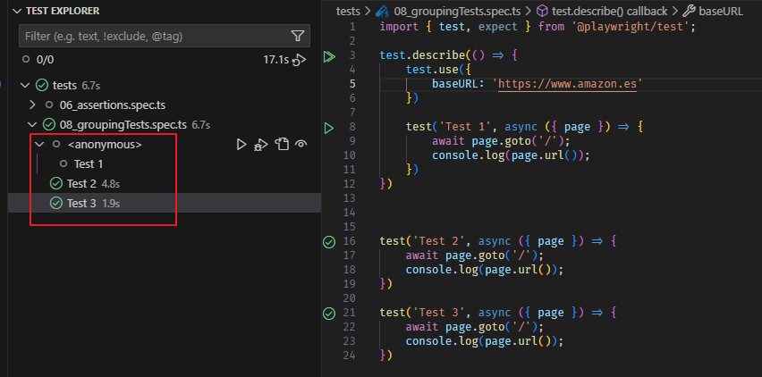
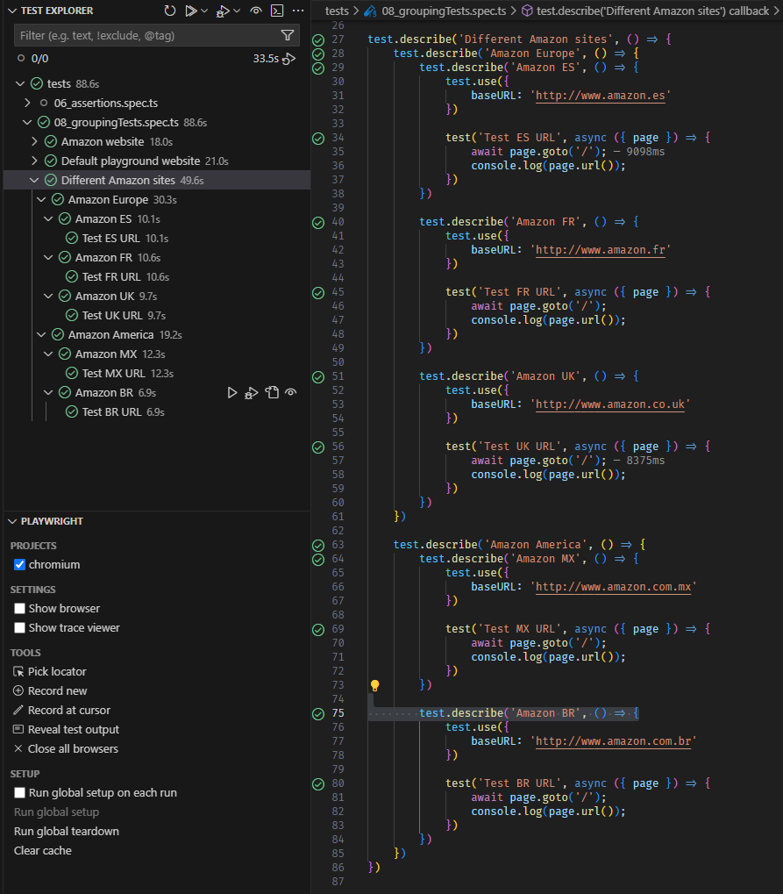
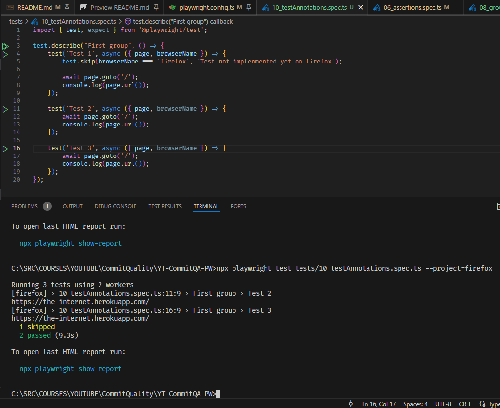
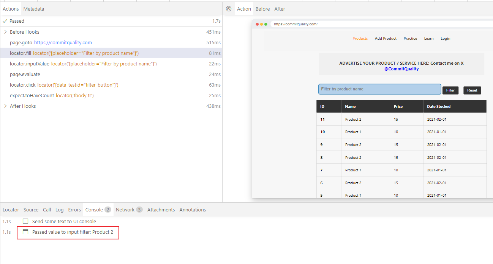

# PLAYWRIGHT DOCUMENTATION

<!-- TABLE OF CONTENTS -->
<details>
  <summary>Table of Contents</summary>
  <ol>
    <li><a href="#Installing Playwright">Installing Playwright</a></li>
    <li>
        <a href="#Assertions">Assertions</a></li>
        <ul>
            <li><a href="https://playwright.dev/docs/test-assertions">PLAYWRIGHT DOCS: Assertions</a></li>
            <li><a href="https://jestts.io/docs/expect">Jest Expect (not fully compatible with PW)</a></li>
        </ul>
    </li>
    <li>
      <a href="#Test configuration">Test configuration made easy (Nodets)</a>
        <ul>
            <li><a href="https://playwright.dev/docs/test-configuration">PLAYWRIGHT DOCS: Test configuration</a></li>
            <li><a href="https://playwright.dev/docs/api/class-testoptions">PLAYWRIGHT DOCS: Test options</a></li>
            <li><a href="https://playwright.dev/docs/test-use-options">PLAYWRIGHT DOCS: Test use options</a></li>
            <li><a href="https://playwright.dev/docs/api/class-testproject">PLAYWRIGHT DOCS: Test project</a></li>
        </ul>
    </li>
    <li><a href="#Grouping tests">Grouping tests</a></li>
    <li>
        <a href="#CLI">CLI</a>
        <ul>
            <li><a href="https://playwright.dev/docs/test-cli">PLAYWRIGHT DOCS: Command line</a></li>
        </ul>
    </li>
    <li><a href="#Annotations">Annotations</a></li>
    <li><a href="#Tags">Tags</a></li>
    <li><a href="#locatoror">Locator.or()</a></li>
    <li><a href="#get-by-methods">Get BY methods</a></li>
    <li><a href="#hooks">Hooks</a></li>
    <li><a href="#fixtures">Fixtures</a></li>
    <li><a href="#use-custom-fixtures-instead-of-hooks">Use custom fixtures instead of hooks</a></li>
    <li><a href="#testdescribeconfigure"><code>test.describe.configure()</code></a></li>
    <li><a href="#pom">POM</a></li>
    <li><a href="#turn-pom-into-fixtures">Turn POM into fixtures</a></li>
    <li><a href="#retry-blocks-of-code-expecttopass">Retry blocks of code => <code>expect.toPass()</code></a></li>
    <li><a href="#multiple-locators--all-">Multiple locators => <code>.all()</code></a></li>
    <li><a href="#multiple-tabs">Multiple tabs</a></li>
    <li><a href="#test-generator">Test generator</a></li>
    <li><a href="#read--write-into-a-csv-file">Read & write into a .csv file</a></li>
    <li><a href="#re-use-state--authentication">Re-use state & authentication</a></li>
    <li><a href="#trace-viewer">Trace viewer</a></li>
    <li><a href="#testinfo">Testinfo</a></li>
    <li><a href="#screenshots-and-video-recording">Screenshots & video recording</a></li>
    <li><a href="#visual-testing">Visual testing</a></li>
    <li><a href="#work-with-multiple-environments-and-environment-variables">Work with multiple environments & environment variables</a></li>
    <li><a href="#global-teardown">Global teardown</a></li>
    <li><a href="#upload-files">Upload files</a></li>
    <li><a href="#miscellaneous">Miscellaneous</a></li>
  </ol>
</details>

## INSTALLING PLAYWRIGHT

1. Install Microsoft Playwright and Playwright Test Snippets VS Code extensions
2. Install latest version of Playwright from terminal (with the following options initially):

   ```sh
   npm init playwright@latest

   Initializing project in '.'
   √ Do you want to use TypeScript or JavaScript? · TypeScript
   √ Where to put your end-to-end tests? · tests
   √ Add a GitHub Actions workflow? (y/N) · false
   √ Install Playwright browsers (can be done manually via 'npx playwright install')? (Y/n) · true
   ```

## ADD TYPE CHECKING AND LINTING TO A PLAYWRIGHT PROJECT

<a href="https://playwright.dev/docs/test-typescript">PLAYWRIGHT DOCS: TypeScript</a>

<a href="https://www.youtube.com/watch?v=3gT7LuzqOAk">Add type checking and linting to your Playwright project</a>

As Playwright does not check the types, it will run tests even if there are non-critical TypeScript compilation errors

Therefore, it is recommended to run TypeScript compiler alongside Playwright to perform type check and also linting our code to prevent specific Playwright errors like missing awaits when necessary or introducing them when they are not required

Most importantly, realize about all of them before spending time on executing the whole testsuite

1. Install TypeScript in the project as a dependency:

    ```sh
    npm install --save-dev typescript
    ```
2. Create a new TypeScript config file:

    ```sh
    npx tsc --init
    ```
3. Run TypseScript compiler, <code>--noEmit</code> will only do the type checking without emitting JavaScript files, <code>-p</code> compiles the project given the path to its configuration file, or to a folder with a <code>'tsconfig.json'</code>, <code>-w</code> watch mode to realize about errors when saving the files:
    ```sh
    npx tsc -p tsconfig.json --noEmit -w
    ```
4. We can also edit <code>package.json</code> file so that we can run the compiler automatically before executting the test command, just by typing <code>npm run test</code> command in the console, as it is annotated with the <code>pre</code> prefix:
    ```json:package.json
    "scripts": {
        "pretest": "tsc --noEmit",
        "test": "playwright test"
    },
    ```
5. Install *typescript-eslint*, that sits on top of *eslint* a very common JavaScript linter but enriched with specific TypeScript features:

    ```sh
    npm install --save-dev eslint @eslint/js typescript typescript-eslint
    ```
6. Create a new configuration file in the root folder <code>"eslint.config.mjs"</code>

    ```js:eslint.config.mjs
    import eslint from '@eslint/js';
	  import tseslint from 'typescript-eslint';

  	export default tseslint.config(
  	  eslint.configs.recommended,
  	  tseslint.configs.recommended,
  	  {
  	    languageOptions: {
  	    parserOptions: {
  	        project: true,
  	        tsconfigRootDir: ".",
  	      },
  	    },
  	    rules : {
  	        "@typescript-eslint/no-floating-promises": "error",
  	        "@typescript-eslint/await-thenable": "error"
  	    }
  	  }
  	);
    ```
7. Run typescript-eslint:
    ```sh
    npx eslint tests/**
    ```
8. Modify <code>package.json</code> file so both compiler and linter are runn before the tests:

    ```json:package.json
    "scripts": {
        "pretest": "tsc --noEmit && eslint tests/**",
        "test": "playwright test"
    },
    ```

## RUNNING TESTS

```sh
npx playwright test
```

```sh
# Execute an specific test
npx playwright test tests/16_fixtures.spec.ts
```
```sh
# Execute in UI mode
npx playwright test tests/16_fixtures.spec.ts --ui
```

```sh
# Execute in debug mode
npx playwright test tests/16_fixtures.spec.ts --debug
```

```sh
# Execute in trace viewer mode
npx playwright test tests/16_fixtures.spec.ts --trace on
```

```sh
#Execute test with UI mode as a tab in the browser
npx playwright test tests/29_traceViewer.spec.ts --ui-port 0
```

```sh
#Execute test with Trace Viewer mode as a tab in the browser
npx playwright show-trace tests/29_traceViewer.spec.ts --port 0
```

```sh
# Run a single project (as Playwright will run all projects in config.ts file by default)
npx playwright test --project=chromiumAuth
```

```sh
# Repeat execution a given number of times
npx playwright test tests/22_multipleLocators.spec.ts --repeat-each 3
```

```sh
# Execute tests that failed in the previous run.
npx playwright test --last-failed
```

```ts
await page.pause();
```

<!--  -->


## ASSERTIONS

<a href="https://playwright.dev/docs/test-assertions">PLAYWRIGHT DOCS: Assertions</a>

<a href="https://jestts.io/docs/expect">Jest Expect (not fully compatible with PW)</a>
<br />

**Specific timeout** for an assertion

```ts
await expect(title, "Page title does not contain Playwright").toHaveText(
  "Playwrighta",
  { timeout: 1234 }
);
```

Negate assertion condition **(NOT)**:

```ts
await expect(title, "Page title does not contain Playwright").not.toHaveText(
  "Playwrighta",
  { timeout: 1234 }
);
```

**Soft assertions**: they don't terminate test execution inmediately, allowing to run the test until the end, but marking it as failed when execution is over

```ts
await expect
  .soft(pageTitle, "Page title does not contain expected text")
  .toHaveText("Welcome to the-interneta", { timeout: 1234 });
await expect(pageTitle, "Page title does not contain expected text").toHaveText(
  "Welcome to the-internet",
  { timeout: 1234 }
);
```

**Polling**: convert a synchronous expect decision to an asynchronous one, with even custom polling intervals:

```ts
await expect
  .poll(
    async () => {
      const labelHello = await page.getByRole("heading", {
        name: "Hello World!",
      });
      return labelHello.textContent();
    },
    {
      // Probe, wait 15s; probe, wait 15s; probe, wait 15s;
      message: "Check it is polling at the required intervals",
      intervals: [15_000, 15_000, 15_000],
      timeout: 60_000,
    }
  )
  .toEqual("Hello World!");
```

## TEST CONFIGURATION

<a href="https://playwright.dev/docs/test-configuration">PLAYWRIGHT DOCS: Test configuration</a>

<a href="https://playwright.dev/docs/api/class-testoptions">PLAYWRIGHT DOCS: Test options</a>

<a href="https://playwright.dev/docs/test-use-options">PLAYWRIGHT DOCS: Test use options</a>

<a href="https://playwright.dev/docs/api/class-testproject">PLAYWRIGHT DOCS: Test project</a>

Playwright has many options to customize the way all the tests are executed by specifying them in the configuration file: playwright.config.ts

- **<code>timeout</code>**: maximum time to be spent for each test execution, including test fixtures and beforeEach hooks.

Global configuration can be overriden locally, in a spec file:

```ts
test.use({ baseURL: "www.opel.es", viewport: { width: 500, height: 500 } });
```

## GROUPING TESTS

Tests can be grouped in **Describe** blocks, allowing to override the default config by setting particular parameters inside _test.use()_ block. Groups that can be of different types:

- Anonymous describe: anonymous callback function grouping the tests
  
- Named describe: add a name to the callback function
  

Describe blocks can be nested also:


## CLI

<a href="https://playwright.dev/docs/test-cli">PLAYWRIGHT DOCS: Command line</a>

Tests can be executed through the Command Line, and there is a lot of options to customize the way tests can be selected and executed. Check Playwright documentation reference.

- Run all the tests

  ```c
  npx playwright test
  ```

- Run a single test file

  ```c
  npx playwright test tests/todo-page.spec.ts
  ```

- Run sets of test files

  ```c
  npx playwright test tests/todo-page/ tests/landing-page/
  ```

- Run all the tests against an specific project
  ```c
  npx playwright test --project=firefox
  ```
- Run in debug mode with Playwright inspector
  ```c
  npx playwright test --debug
  ```
- Run with Playwright Trace viewer
  ```c
  npx playwright test --trace on
  ```  
- Set maximum number fo retries for failed tests
  ```c
  npx playwright test --retries 2
  ```

## ANNOTATIONS

<a href="https://playwright.dev/docs/test-annotations">PLAYWRIGHT DOCS: Annotations</a>

<a href="https://playwright.dev/docs/api/class-test">PLAYWRIGHT DOCS: Test class</a>
Annotations can be added to a single test or a group of tests.

- **<code>Only</code>**: When there are focused tests, only these tests run. It can be applied to tests or describe blocks
  ```ts
  test.only('Test BR URL', async ({ page }) => { ... })
  ```

  ```ts
  test.describe.only('Group of tests', async ({ page }) => { ... })
  ```

- **<code>Skip</code>**: Marked tests as skip won't be executed. It can be applied to tests or describe blocks

  ```ts
  test.skip('Test ES URL', async ({ page }) => { ... })
  ```

  ```ts
  test.describe.only('Group of tests - 2', async ({ page }) => { ... })
  ```

- **<code>Conditional skip</code>**: Tests will be skipped depending on a condition
  
  ```ts
  test("skip this test", async ({ page, browserName }) => {
    test.skip(browserName === "firefox", "Still not working on Firefox");
  });
  ```
  
- **<code>Fixme</code>**: marks the test as failing. Playwright will not run this test, as opposed to the fail annotation. Use fixme when running the test is slow or crashes
  ```ts
  test.fixme('Test ES URL', async ({ page }) => { ... })
  ```
- **<code>Fail</code>**: marks the test as failing. Playwright will run this test and ensure it does indeed fail. If the test does not fail, Playwright will complain.
- **<code>Slow</code>**: marks the test as slow and triples the test timeout
- **<code>Parallel</code>**: when in config.ts fullyparallel is disabled, we can apply certain parallelism to a given scope (top level or inside a describe). See more <a href="https://playwright.dev/docs/api/class-test#test-describe-configure">here</a>

  ```ts
  test.describe.parallel("Second group", () => {
    test("Test 3", async ({ page, browserName }) => {
      test.fail();
      await page.goto("/");
      console.log(page.url());
    });
  });
  ```

  Annotations can have also a more substantial content, to provide more context that will be also available to the reporter API.


## TAGS

<a href="https://playwright.dev/docs/test-annotations#tag-tests">PLAYWRIGHT DOCS: Tag tests</a>

It is necessary usually to tag tests and then filter by tag in the test report. Or you might want to only run tests that have a certain tag:

```ts
test("Test 1", { tag: "@Cosmetic" }, async ({ page }) => {
  await page.goto("/");
  const subTitle = page.locator("h2");
  await expect(subTitle).toHaveText("Available Examples");
});
```

More than one tag can be added to a test with an array of tags:

```ts
test("Test 2", { tag: ["@Cosmetic", "@Smoke"] }, async ({ page }) => {
  await page.goto("/");
  const subTitle = page.locator("h2");
  await expect(subTitle).toHaveText("Available Examples");
});
```

Tests with a particular tag can be run from CLI:

```
npx playwright test --grep @Cosmetic
```

And also skipped:

```c
npx playwright test --grep-invert @Cosmetic
```

To run tests containing either tag (logical OR operator):

```c
npx playwright test --grep "@fast|@slow"
```

Or run tests containing both tags (logical AND operator) using regex lookaheads:

```c
npx playwright test --grep "(?=.*@fast)(?=.*@slow)"
```

Not only tags can be set in test files, but also in <a href="https://playwright.dev/docs/api/class-testconfig#test-config-grep">testConfig</a> and <a href="https://playwright.dev/docs/api/class-testproject#test-project-grep">testProject</a> in config.ts file

```ts
projects: [
{
    name: 'deploy',
    grep: /@Smoke|@Regression/,
    use: { ...devices['Desktop Chrome'] },
},
{
    name: 'dev',
    grepInvert: /@Regression/,
    use: { ...devices['Desktop Chrome'] },
},
```

## LOCATORS

<a href="https://playwright.dev/docs/locators">PLAYWRIGHT DOCS: Locators</a>

<a href="https://playwright.dev/docs/best-practices#use-locators">PLAYWRIGHT DOCS: Best Practices: Use locators</a>

Locators represent the way to find element(s) on the page at any moment, and are the core of Playwright's auto-waiting and retry-ability:

```ts
//CSS ID
await page.locator("#root");
```

```ts
//CSS CLASS
await page.locator(".filter-textbox").fill("Hello world");
```

```ts
//ATTRIBUTE: data-testid
await page.locator('[data-testid="reset-filter-button"]').click();
```

```ts
//FIND BY TEXT
await page.locator('text="Add Product"').click();
```

```ts
//FIND BY PLACEHOLDER
await page.locator('[placeholder="Enter a price"]').click();
```

```ts
//FIND BY CLASS AND TEXT
await page.locator(".nav-link", { hasText: "Login" }).click();
```

### <code>Locator.or()</code>

Creates a locator matching all elements that match one or both of the two locators:

<a href="https://playwright.dev/docs/api/class-locator#locator-or">PLAYWRIGHT DOCS: Locator.or()</a>

```ts
const newEmail = page.getByRole('button', { name: 'New' });
const dialog = page.getByText('Confirm security settings');
await expect(newEmail.or(dialog)).toBeVisible();
if (await dialog.isVisible())
  await page.getByRole('button', { name: 'Dismiss' }).click();
await newEmail.click();
```


## GET BY METHODS

<a href="https://playwright.dev/docs/locators#locating-elements">PLAYWRIGHT DOCS: GetBy Locators</a>

- **<code>page.getByRole():</code>** locate an element by explicit and implicit accessibility attributes, that can characterize it as a button or a link, for example, and usually passing the accessible name too in order to find the exact element:

  ```ts
  await page.getByRole("link", { name: "React New", exact: true }).click();
  ```

- **<code>page.getByPlaceholder():</code>** locate an element by placeholder:

  ```ts
  const inputTodo = await page.getByPlaceholder("What needs to be done?");
  ```

- **<code>page.getByText():</code>** locate an element by text content:

  ```ts
  await expect(page.getByText(task1Text, { exact: true })).toBeVisible();
  ```

- **<code>page.getByTestId():</code>** locate an element based on its data-testid attribute (although other attributes can be configured):

  ```ts
  await expect(page.getByTestId("header").getByRole("heading")).toHaveText(
    "todos"
  );
  ```

- **<code>page.getByLabel():</code>** locate a form control by associated label's text:
  ```ts
  await page.getByLabel("Buscar con Google").last().click();
  ```
- **<code>page.getByAltText():</code>** to locate an element, usually image, by its text alternative:

  ```ts
  await page.getByLabel("Buscar con Google").last().click();
  ```

- **<code>page.getByTitle():</code>** locate a form control by associated label's text:
  
  ```ts
  page.getByTitle("Buscar").fill("Juan Valdez");
  ```

## HOOKS

<a href="https://playwright.dev/docs/api/class-test">PLAYWRIGHT DOCS: Test hooks</a>

A hook not only can be used at test file level, but also inside of a _describe_ block:

```ts
test.describe("Group of tests", () => {
  test("Test 1");
});
```

Pay attention to the number of runners (parallelism), as if we have 2 runners for example, hook will be run twice.


## FIXTURES

<a href="https://playwright.dev/docs/test-fixtures">PLAYWRIGHT DOCS: Fixtures</a>

Test fixtures are used to establish the environment for each test, being passed to the test declaration, giving the test everything it needs and nothing else. Test fixtures are isolated between tests. With fixtures, you can group tests based on their meaning, instead of their common setup:

- **PAGE:** isolated page for this test run

- **CONTEXT:** isolated context for a test run (BrowserContext), getting a fresh environment like starting a new incognito session

- **BROWSER:** browser instance shared between all tests in the same worker. But it is also important to mention that each test runs in an isolated BrowserContext

- **BROWSERNAME:** The name of the browser currently running the test. Either chromium, firefox or webkit

- **REQUEST:** Isolated APIRequestContext instance for this test run


## USE CUSTOM FIXTURES INSTEAD OF HOOKS

<a href="https://playwright.dev/docs/test-fixtures#with-fixtures">PLAYWRIGHT DOCS: With Fixtures</a>

In order to use Custom Fixtures, we have to extend base test by providing these two new created fixtures, that can be used in multiple test files. In a real world scenario this wouldn't be located inside a test class, but into a different class and then, other fixture classes would extend everything required, being imported then at the top of each test:

```ts
let x: number;

type newFixtures = {
  //Define fixtures of any type
  fixtureOne: any;
  fixtureTwo: any;
};

const test = base.extend<newFixtures>({
  fixtureOne: async ({}, use) => {
    const fixtureOne = undefined;
    x = 1;

    await use(fixtureOne);
  },
  fixtureTwo: async ({}, use) => {
    const fixtureTwo = undefined;
    x = 2;

    await use(fixtureTwo);
  },
});

test("Test 1", async ({ fixtureOne }) => {
  expect(x).toBe(1);
});

test("Test 2", async ({ fixtureTwo }) => {
  expect(x).toBe(2);
});
```

## <code>test.describe.configure()</code>

<a href="https://playwright.dev/docs/api/class-test#test-describe-configure">PLAYWRIGHT DOCS: test.describe.configure</a>

Allows to customize options related to parallelism, retries and timeout with a scope for all the tests inside a test file or limited to the scope of a describe block:

```ts
import { test } from "@playwright/test";

//By default, it Will take values for parallelism, retries and timeout from config.ts file
//But we are going to customize them with test.describe.configure() for this test file
test.describe.configure({ mode: "parallel", retries: 1, timeout: 3 * 1111 });
test("Test example", async ({ page }) => {
  await page.goto("https://playwright.dev/");
  await page.locator(".fake").waitFor();
});

//OR, we can limit the scope of the customized options to inside the describe block
test.describe("Example of grouped tests", () => {
  test.describe.configure({ mode: "parallel", retries: 2, timeout: 2 * 1111 });
  test("Scoped test", async ({ page }) => {
    await page.goto("https://playwright.dev/");
    await page.locator(".fake").waitFor();
  });
});
```

## POM

<a href="https://playwright.dev/docs/pom">PLAYWRIGHT DOCS: POM</a>

A new folder _support_ was added to store the POM related code. Inside _POM_ folder, code is organized in a folder _pages_, storing the abstractions for each whole Page, and another folder _sections_ containing sections of a Page, a level of abstraction to avoid Pages getting a huge size and fostering reutilization. This way of implementing POM might be different to the one described in Playwright documentation.

## TURN POM INTO FIXTURES

<a href="https://playwright.dev/docs/pom">PLAYWRIGHT DOCS: POM</a>

Inside of _tests_ folder, we will create a new folder called _fixtures_. We'll also create a new class _basePage_, to extend the basic Test class that is provided by Playwright. We extend it by importing the POM classes that we will need to use in the test:

```ts
import { test as base } from "@playwright/test";
import ComputersPage from "../../support/POM/pages/computers.page";
import AddComputerPage from "../../support/POM/pages/addComputer.page";

export const test = base.extend<{ computersPage: ComputersPage;  AddComputerPage: AddComputerPage; }>
({
  //Define a fixture
  computersPage: async ({ page }, use) => {
    await use(new ComputersPage(page));
  },
  AddComputerPage: async ({ page }, use) => {
    await use(new AddComputerPage(page));
  },
});
```

And we don't need to instantiate anything inside the test as all the functionality is provided through the extended basePage:

```ts
test("Basic POM test - Actions", async ({ computersPage, AddComputerPage }) => {
  await computersPage.goto();
  await computersPage.clickAddNewComputer();
  await AddComputerPage.addComputerActions.enterNewComputerInfo();
  await AddComputerPage.addComputerActions.clickCreateComputerButton();
  await computersPage.assertNewComputerCreated();
});
```

## RETRY BLOCKS OF CODE (expect.toPass())

<a href="https://playwright.dev/docs/test-assertions#expecttopass">PLAYWRIGHT DOCS: expect.toPass</a>

We have the ability to retry specific blocks of code until all assertions successfully pass or timeout is hit. We must create an *expect.toPass()* block with a callback function and put inside all the flaky code we want to retry:
```ts
test("No POM test", async ({ page }) => {
    //Create an *expect* block with a callback function and put inside all the flaky code we want to retry
    await expect(async () => {
        await page.goto("https://computer-database.gatling.io/computers");
        await page.getByText("Add a new computer").click();
        await page.locator("#name").fill("ACME v1");
        await page.locator("#introduced").fill("1999-11-11");
        await page.locator("#discontinued").fill("2000-11-11");
        await page.locator("#company").selectOption({ label: "Apple Inc." });
        await page.getByText("Create this computer").click();
    
        await expect(page.getByText("Done ! Computer ACME v1 has been createdAAA")).toBeVisible();
    }).toPass({timeout: 17967});    
});
```

## MULTIPLE LOCATORS [ .all() ]

Using <code>page.locator().all()</code>, retrieve all the matching elements on a page and iterate through all of them by using forof snippet:
```ts
for (const element of await page.locator('tbody td a').all()) {
        await element.click();
        await page.waitForTimeout(500);
        await expect(page.getByText('Edit computer')).toBeVisible();
        await page.goBack();
    }
```


## MULTIPLE TABS

```ts
test('Working with multiple tabs', async ({ page, context }) => {
    await page.goto("https://www.amazon.co.uk");

    //Create second tab
    const newTab = await context.newPage();
    await newTab.goto("https://www.ebay.co.uk");

    //Bring first tab to the front again
    await page.bringToFront();

    //Interact and close second tab
    await newTab.locator("#gh-ac").fill("Pokemon");
    await newTab.close();
})
```

## TEST GENERATOR

<a href="https://playwright.dev/docs/codegen">PLAYWRIGHT DOCS: Test generator</a>

Open test generator in the desired URL:
```sh
npx playwright codegen https://www.google.com
```

Customize viewport size:
```sh
npx playwright codegen --viewport-size=800,600 https://www.google.com
```

## READ & WRITE INTO A .CSV FILE

<a href="https://c2fo.github.io/fast-csv/docs/introduction/install">FAST-CSV DOCS: Installation</a>

fast-csv package installation:
```sh
npm i -S fast-csv
```

The promise returns a JSON array that´s what we are going to transform this CSV into:
```ts
import { test } from "@playwright/test";
import * as csvParser from "@fast-csv/parse";
import { writeToPath } from "fast-csv";

test('CSV Test', async ({  }) => {
    let myObject : any = new Promise((resolve) => {
        let dataArray: JSON[] = [];
        csvParser.parseFile("./support/CSV/cap27TestData.csv", { headers: true })
            .on("data", (dataFromFile) => {
                dataArray.push(dataFromFile);
            })
            .on("end", () => {
                resolve(dataArray);
            })
    })

    let output = await myObject;
    console.log(output);
    //Get access to a particular element
    console.log(output[0]);
    //Get access to a property of a particular element
    console.log(output[0].Product);

    //WRITE INTO A .CSV FILE: add a new column and write values
    const dataWithPrices: any = Array.from(output);
    //Add headers to the new array
    await dataWithPrices.unshift({ Product: "Product", Quantity: "Quantity", Price: "Price" });
    //Add a new value to the array
    await dataWithPrices.push({ Product: "Teddy bear", Quantity: "11", Price: "14.99" });
    //Write it into a new .csv file
    writeToPath("./support/CSV/temp.csv", dataWithPrices);
})
```
## RE-USE STATE & AUTHENTICATION

<a href="https://playwright.dev/docs/auth">PLAYWRIGHT DOCS: Authentication</a>

<a href="https://playwright.dev/docs/codegen#preserve-authenticated-state">PLAYWRIGHT DOCS: CODEGEN - Preserve authenticated state</a>

### a) Authentication with Global Setup

In order to be able to login once and reuse state across all the tests:

1. Create a global setup file, so it will run the authentication code once before all the tests, as it is expected that authentication state will have an expiration time so tokens will have a short lifetime:
    ```ts
    import { Browser, chromium, Page, expect } from "@playwright/test";

    async function globalSetup() {
        const browser: Browser = await chromium.launch({ headless: false });
        const context = await browser.newContext();
        const page: Page = await context.newPage();

        await page.goto("https://demoblaze.com");
        await page.locator("#login2").click();
        await page.locator("#loginusername").fill("test");
        await page.locator("#loginpassword").fill("test");
        await page.getByRole('button', { name: 'Log in' }).click();
        await expect(page.locator("#logout2")).toBeVisible( {timeout: 6767} );

        //SAVE THE STATE OF THE WEBPAGE AS WE ARE ALREADY LOGGED IN
        await page.context().storageState({ path: "./support/Auth/demoBlazeLoginAuth.json" });

        await browser.close();
    }

    export default globalSetup;
    ```
2. Using Playwright state storage capabilities, app authentication state information will be stored in this global setup file so that it is not necessary to log in all the time
3. Indicate in playwright.config.ts that we want to use this global setup file:
    ```ts
    /* Select the global setup file to be used, i.e. for keeping state & authentication purposes */
    globalSetup: "./global-setup.ts",
    ```
4. This state information stored in the JSON file could be used: 
    1. For all the projects (<code>use</code> section in playwright.config.ts):
        ```ts
        /* Tests will load authenticated state information from the given JSON file */     
        storageState: "./support/Auth/demoBlazeLoginAuth.json",
        ```

    2. For an specific project (<code>projects</code> section in playwright.config.ts):
        ```ts
        projects: [
            {
              name: 'chromiumAuth',
              use: { ...devices['Desktop Chrome'],
                storageState: "./support/Auth/demoBlazeLoginAuth.json"
              },
            },
        ```
        ```sh
        npx playwright test --project=chromeAuth
        ```

In case we don't want to be logged in for a certain test, we can pass to it the fixture *context* and invoke its method *clearCookies():*
```ts
test('Clear cookies from context', { tag: "@reuseAuth_28" }, async ({ page, context }) => {
    //By clearing the cookies we won't be logged in
    await context.clearCookies();
    
    await page.goto("https://demoblaze.com");
    await expect(page.locator("#logout2")).toBeVisible();
})
```
Or, if we want to use different authentication JSON for certain test files, by passing it as an argument to *test.use()*:
```ts
test.use({ storageState: "./support/Auth/noAuth.json" });
test.only('Use a different Auth file', { tag: "@reuseAuth_28" }, async ({ page }) => {
    await page.goto("https://demoblaze.com");
    await expect(page.locator("#logout2")).toBeVisible( {timeout: 8888});
})
```

### b) Authentication with Playwright Dependencies

Authentication can be done with Playwright Dependencies, a new functionality from version 1.32, in order to make this process more efficient.  

1. In global-setup.ts file, move globalSetup() function content to a test spec created the same way like in any other spec file: we won't need context and page fixtures:

    ```ts
    import { test, expect } from "@playwright/test";
    
    test('Login with PW Dependencies', async ({ page }) => {
      await page.goto("https://demoblaze.com");
      await page.locator("#login2").click();
      await page.locator("#loginusername").fill("test");
      await page.locator("#loginpassword").fill("test");
      await page.getByRole('button', { name: 'Log in' }).click();
      await expect(page.locator("#logout2")).toBeVisible( {timeout: 6767} );

      //SAVE THE STATE OF THE WEBPAGE AS WE ARE ALREADY LOGGED IN
      await page.context().storageState({ path: "./support/Auth/demoBlazeLoginAuthWithPWDependencies.json" });  
    )
    ```

2. In config.ts file:
	1. Remove globalSetup:

    ```ts
      globalSetup: "./global-setup.ts",
    ```

	2. Move storageState from global Use to the Projects:

    ```ts
      projects: [
                  {
                    name: 'chromiumAuthWithPWDependencies',
                    use: { ...devices['Desktop Chrome'],
                      storageState: "./support/Auth/demoBlazeLoginAuthWithPWDependencies.json"
                    },
                  },
    ```
    
3. Create a new Project with the only purpose of executing this global setup, so that *testDir* points to the directory where global-setup.ts is located (in this particular case, root directory) and *testMatch* equals 'global-setup.ts':
    ```ts
    {
      name: 'globalSetup',
      testDir: './',
      testMatch: 'global-setup.ts',
    },
    ```

4. For each project wher Authentication is required, add a value for *dependencies*, an array of strings that contains the names of the projects that are going to be executed before this one:

    ```ts
    {
      name: 'chromiumAuthWithPWDependencies',
      dependencies: ['globalSetup'],
      use: { ...devices['Desktop Chrome'],
        storageState: "./support/Auth/demoBlazeLoginAuthWithPWDependencies.json"
      },
    },
    ```


### c) Record with Playwright Test Generator

<a href="https://playwright.dev/docs/codegen#preserve-authenticated-state">PLAYWRIGHT DOCS: Preserve authenticated state</a>


## TRACE VIEWER

<a href="https://playwright.dev/docs/trace-viewer-intro">PLAYWRIGHT DOCS: Trace viewer introduction</a>

<a href="https://playwright.dev/docs/trace-viewer">PLAYWRIGHT DOCS: Trace viewer features</a>

Ways to generate trace viewer file:

1. Via command line
    ```sh
    npx playwright test --trace on
    ```

2. In config.ts:
	
    a) Globally:
    ```ts
		use: {
			trace: 'retain-on-failure',
    ```  

	  b) In an specific project:
    ```ts
		projects: [
		    {
		      name: 'chromiumTraceViewer',
		      use: { ...devices['Desktop Chrome'],
		        trace: "retain-on-failure"
	
		       },
		    },
    ```        

Trace viewer generated file can be opened:

1. Via command line, command is generated after test execution:
    ```sh
    npx playwright show-trace test-results\29_traceViewer-Trace-viewer-chromium\trace.zip
    ```

2. Via Trace webapp (https://trace.playwright.dev/)

## TESTINFO

<a href="https://playwright.dev/docs/api/class-testinfo">PLAYWRIGHT DOCS: Test info class</a>

<code>TestInfo</code> contains information about currently running test, providing utilities to control test execution: attach files, update test timeout, determine which test is currently running and whether it was retried, etc. <code>TestInfo</code> is available to test functions, test.beforeEach(), test.afterEach(), test.beforeAll() and test.afterAll() hooks, and test-scoped fixtures.

```ts
//Use testInfo.title to provide the name of the screenshot file
const screenshot = await page.screenshot({
    path: `./support/screenshots/${testInfo.title}.png`
});

//Use testInfo.setTimeout to change the default timeout
testInfo.setTimeout(testInfo.timeout + 2000);

//Use testInfo.attach to attach a value or a file from disk to the current test
await testInfo.attach('screenshot', { body: screenshot, contentType: 'image/png' });
```

## SCREENSHOTS AND VIDEO RECORDING

<a href="https://playwright.dev/docs/screenshots">PLAYWRIGHT DOCS: Screenshots</a>

<a href="https://playwright.dev/docs/videos">PLAYWRIGHT DOCS: Videos</a>

Screenshots and video recording options can be configured:

* For all the projects (<code>use</code> section in playwright.config.ts):
    ```ts
      use: {
        screenshot: "only-on-failure",
        video: "retain-on-failure"
    ```

* For an specific project (<code>projects</code> section in playwright.config.ts):
    ```ts
        projects: [
            {
              name: 'chromiumAuth',
              use: { ...devices['Desktop Chrome'],
                storageState: "./support/Auth/demoBlazeLoginAuth.json"
              },
              screenshot: 'only-on-failure',
              video: 'retain-on-failure'
            },
    ```

## VISUAL TESTING
<a href="https://playwright.dev/docs/test-snapshots">PLAYWRIGHT DOCS: Visual comparison</a>

In order to update the currently existing reference snapshots:
```sh
npx playwright test --update-snapshots
```
Default thresholds for all tests can be set in <code>expect</code> section of *playwright.config.ts:* 

```ts
  expect : {
    // Maximum time expect() should wait for the condition to be met.
    timeout: 4321,
    //Visual testing comparison thresholds
    toHaveScreenshot: {
      maxDiffPixels: 85,
      maxDiffPixelRatio: 0.03
    }
  },

```
Also consider that different images are generated depending on the vieport sizes of the devices in the different projects, for example: 

```ts
    {
      name:"iphone",
      use:{
        ...devices['iPhone 15']
      }
    }

```

## WORK WITH MULTIPLE ENVIRONMENTS AND ENVIRONMENT VARIABLES
<a href="https://playwright.dev/docs/test-parameterize#passing-environment-variables">PLAYWRIGHT DOCS: Passing Environment Variables</a>

<a href="https://github.com/motdotla/dotenv">Dotenv library</a>


We will handle multiple environments and multiple environment variables files by using *dotenv* npm package.

1. Install dotenv package: 
      ```sh
      npm install dotenv --save
      ```
2. Create env folder and add .env files inside it

3. Customize options in config.ts file:
	1. Import package
          ```ts
            import dotenv from "dotenv";
          ```

	2. Add paths to the created env files, in a way we can point to them by setting an environment variable in Powershell (in this case: <code>EXECUTION_ENVIRONMENT</code>) before running our tests:
        ```ts
          dotenv.config({
            path: `./env/.${process.env.EXECUTION_ENVIRONMENT}`
          })
        ```
4. Open Powershell console and set the value of the EXECUTION_ENVIRONMENT variable and run the tests:
      ```sh
      $env:EXECUTION_ENVIRONMENT="prod"
      npx playwright test tests/39_multipleEnvironments.spec.ts
      ```

## GLOBAL TEARDOWN

It works in a pretty similar way than the use of global-setup with Playwright dependencies:

1. Create a new file in the root of the project, <code>global-teardown.ts</code> containing the logic to be executed in the tests teardown

2. Create a new Project with the only purpose of executing this global teardown, so that testDir points to the directory where global-teardown.ts is located (in this particular case, root directory), testMatch equals 'global-teardown.ts' and we ensure that we are properly authenticated by the use of the storageState variable pointing to right file:
    ```ts
        {
          name: 'globalTeardown',
          testDir: './',
          testMatch: 'global-teardown.ts',
          use: { 
            storageState: "./support/Auth/demoBlazeLoginAuthWithPWDependencies.json"
          },
        },
    ```
3. Ensure that in globalSetup project, there is a value called <code>teardown</code> pointing to the 'globalTeardown' project just defined:
      ```ts
          {
            name: 'globalSetup',
            testDir: './',
            testMatch: 'global-setup.ts',
            teardown: 'globalTeardown'
          },
      ```
## UPLOAD FILES
<a href="https://playwright.dev/docs/input#upload-files">PLAYWRIGHT DOCS: ACTIONS => upload files</a>

<a href="https://playwright.dev/docs/events">PLAYWRIGHT DOCS: EVENTS (handle popup message)</a>


## EXTENDED TEST ASSERTIONS WITH CUSTOM MATCHERS
<a href="https://playwright.dev/docs/test-assertions#add-custom-matchers-using-expectextend">PLAYWRIGHT DOCS: ASSERTIONS => Add custom matchers using expect.extend()</a>

Playwright assertions can be extended by providing custom matchers. These matchers will be available on the expect object.

1. Add a new file <code>customAssertions.ts</code> where the new assertion will be defined:

```ts:customAssertions.ts
import { expect as baseExpect } from '@playwright/test';
import type { Locator } from '@playwright/test';

export { test } from '@playwright/test';

//Create a custom expect function that extends the base expect function
export const expect = baseExpect.extend({
    //Define a custom matcher, with the name we want to give to our new assertion
    /**
     * 
     * @param locator Locator of the element containing the elements we are going the check the maximum length
     * @param expectedLength Expected maximum legth value to compare
     * @param options Stick to timeout, contained in the base class
     */
    async toHaveMaxLength(locator: Locator, expectedLength: number, options?: {timeout?: number}){
        let pass: boolean;
        let matcherResult: any;

        try {
            //Attempting to check if the element has a maxlength attribute with the expected value
            await baseExpect(locator).toHaveAttribute('maxlength', String(expectedLength), options);
            pass = true;
        } catch (e: any) {
            //If an error occurs, catch and handle
            matcherResult = e.matcherResult;
            pass = false;
        }

        //Create a message based on the result
        const message = pass ? () => "Assertion passed!!!!" : () => this.utils.matcherHint("toHaveMaxLength", undefined, undefined) 
        + `\n` + `Expected: ${this.utils.printExpected(expectedLength)} Received: ${this.utils.printReceived(matcherResult.actual)}`

        //Return the object with the information about the assertion
        return {
            message, 
            pass, name: "toHaveMaxLength", 
            expectedLength, 
            actual: matcherResult?.actual,
        }
    }
})
```

2. In the test files, test fixtures import comes from the added assertion files instead of <code>"@playwright/test"</code>:

```ts:test.spec.ts
import { test, expect } from "../support/Assertions/customAssertions"

test('Extended assertions', async ({ page }) => {
    await page.goto("https://commitquality.com")
    const textbox = page.getByPlaceholder("Filter by product name")
    await page.pause()
    await expect(textbox).toHaveMaxLength(10)
})
```
Something that must be taken also into account is that custom matchers from multiple files or modules can be <a href="https://playwright.dev/docs/release-notes#merge-test-fixtures">merged</a>:
```ts:fixtures.ts
import { mergeTests, mergeExpects } from '@playwright/test';
import { test as dbTest, expect as dbExpect } from 'database-test-utils';
import { test as a11yTest, expect as a11yExpect } from 'a11y-test-utils';

export const test = mergeTests(dbTest, a11yTest);
export const expect = mergeExpects(dbExpect, a11yExpect);
```

```ts:test.spec.ts
import { test, expect } from './fixtures';

test('passes', async ({ page, database }) => {
  await expect(database).toHaveDatabaseUser('admin');
  await expect(page).toPassA11yAudit();
});
```
## EMULATE DEVICES

<a href="https://playwright.dev/docs/emulation">PLAYWRIGHT DOCS: EMULATION</a>

A real device behavior can be emulated by modifying certain parameters in <code>playwirght.config.ts</code> file

```ts:playwright.config.ts
    {
      name: 'iPhone15',
      use: { 
        ...devices['iPhone 15'],
        locale: "es_ES",
        timezoneId:"Europe/Madrid",
        baseURL: "https:///www.google.com",
       },
    },
    {
      name: 'ownEmulation',
      use: { 
        viewport: { width: 1024, height: 768 },
        baseURL: "https://www.gps-coordinates.net/my-location",
        userAgent:"Subscribe",
        permissions: ["geolocation"],
        geolocation: { latitude: 44.790341, longitude: 20.455368 },
       },
    },
```
## ACCESSIBILITY TESTING

<a href="https://playwright.dev/docs/accessibility-testing">PLAYWRIGHT DOCS: ACCESSIBILITY TESTING</a>

## HANDLE RANDOM POPUPS

<a href="https://playwright.dev/docs/api/class-page#page-add-locator-handler">PLAYWRIGHT DOCS: <code>addLocatorHandler</code></a>

## FILE DOWNLOADS

<a href="https://playwright.dev/docs/downloads">PLAYWRIGHT DOCS: Downloads</a>

```ts:test.spec.ts
test('Download file', async ({ page }) => {
    await page.goto('https://commitquality.com/practice-file-download')

    // Start waiting for download before clicking. Note no await.
    const downloadPromise = page.waitForEvent('download');

    await page.getByText('Download file').click();
    const download = await downloadPromise;

    // Wait for the download process to complete and save the downloaded file somewhere.
    await download.saveAs('./support/Downloads' + download.suggestedFilename());
})
```

## CLOCK

<a href="https://playwright.dev/docs/clock">PLAYWRIGHT DOCS: CLOCK</a>

<a href="https://playwright.dev/docs/api/class-clock">PLAYWRIGHT DOCS: CLOCK class</a>

```ts:test.spec.ts
import { expect, test } from "@playwright/test"

test('Clock', async ({ page }) => {
    
    // Set the system clock to 9:00
    //await page.clock.setFixedTime(new Date("2025-01-01T09:00:00"))
    //await page.clock.setSystemTime(new Date("2025-01-01T09:00:00"))
    await page.clock.install()

    await page.goto('https://commitquality.com/practice-clock')
    await page.pause()

    //Jump forward 5 minutes
    await page.clock.fastForward('05:00')
    await expect(page.getByTestId('message')).toContainText('SUBSCRIBE TO COMMIT QUALITY')    
})
```
## API TESTING

<a href="https://playwright.dev/docs/api-testing">PLAYWRIGHT DOCS: API testing</a>

For API testing, the required fixture is <code>request</code>. In this case we will test a GraphQL API:

```ts:test.spec.ts

test('Multiple API requests in a single test', async ({ request }) => {
    const allCountriesResponse = await request.post("https://countries.trevorblades.com/graphql", {
        //Define what the request POST body should be
        data: {
            //Inside "data" pass in the query we built with the GraphQL playground editor
            query: `
            {
                countries {
                    name
                    code
                    emoji
                    languages {
                        name
                        code
                    }
                }
            }`
        }
    })

    const allCountriesBody = await allCountriesResponse.json()

    const armeniaResponse = await request.post("https://countries.trevorblades.com/graphql", {
        data: {
            query: `
            {
                countries(filter: {code: {eq: "${allCountriesBody.data.countries[6].code}" }}) {
                    name
                    capital
                    code
                    emoji
                    languages {
                        name
                        code
                    }
                }
            }`
        }
    })

    const armeniaBody = await armeniaResponse.json()
    expect(armeniaResponse.status()).toBe(200)
    expect(armeniaBody.data.countries).toHaveLength(1)
    expect(armeniaBody.data.countries[0].capital).toBe("Yerevan")
})

```

## RUN PLAYWRIGHT TESTS WITH GITHUB ACTIONS INSIDE DOCKER

<a href="https://playwright.dev/docs/ci-intro">PLAYWRIGHT DOCS: Setting up CI</a>

<a href="https://playwright.dev/docs/ci">PLAYWRIGHT DOCS: Continuous Integration</a>

1. Create a new public repo: YT-QARoutine-PW
2. In VSCode navigate to the parent folder

    ```sh
        cd C:\SRC\COURSES\YOUTUBE\QARoutine
    ```
3. Clone repo to local machine:

    ```sh
        git clone https://github.com/Hamming77/YT-QARoutine-PW-FirstTest.git
    ```

4. Navigate to the created local folder:

    ```sh
        cd /YT-QARoutine-PW-FirstTest.git
    ```    

5. Install needed SW in the created folder

    ```sh
        npm init playwright@latest
    ```    

	When installing Playwright don't forget to add a <code>.yaml</code> file for Github Actions

6. When installed, edit playwright.yml file to ensure that tests execution is only triggered on every Push in the **main** branch and not with every Pull Request:

    ```yml
        name: Playwright Tests
        on:
            push:
                branches: [ main ]
        jobs:
            test:
                timeout-minutes: 60
                runs-on: ubuntu-latest
                steps:
                - uses: actions/checkout@v4
                - uses: actions/setup-node@v4
                with:
                    node-version: lts/*
                - name: Install dependencies
                run: npm ci
                - name: Install Playwright Browsers
                run: npx playwright install --with-deps
                - name: Run Playwright tests
                run: npx playwright test
                - uses: actions/upload-artifact@v4
                if: ${{ !cancelled() }}
                with:
                    name: playwright-report
                    path: playwright-report/
                    retention-days: 30
    ```

7. Run test locally

    ```sh
    npx playwright run
    ```

8. Push changes to Github. Go to Actions tab in Github and check that test execution has been automatically triggered

9. Make a test fail and push the changes. Check test has failed in Actions, and the 2 retry attempts

10. Change playwright.yml in order to run the tests in Docker containers:

    ```yml
        name: Playwright Tests
        on:
            push:
                branches: [ main ]
        jobs:
            playwright:
                name: 'Playwright Tests'
                runs-on: ubuntu-latest
                container:
                    image: mcr.microsoft.com/playwright:v1.49.1-noble
                    options: --user 1001
                steps:
                - uses: actions/checkout@v4
                - uses: actions/setup-node@v4
                    with:
                        node-version: lts/*
                - name: Install dependencies
                    run: npm ci
                - name: Run your tests
                    run: npx playwright test
    ```                    

11. Fix the test to pass again and push all the changes

12. It will trigger as many executions as .yaml file are existing inside <code>workflows</code> folder, so it can be useful to setup different workflows with different configurations

## SHARDING WITH MERGED REPORTS
<a href="https://playwright.dev/docs/test-sharding">PLAYWRIGHT DOCS: Sharding</a>

<a href="https://playwright.dev/docs/test-parallel">PLAYWRIGHT DOCS: Parallelism</a>

<a href="https://playwright.dev/docs/test-reporters">PLAYWRIGHT DOCS: Test Reporters</a>

 By default, Playwright runs test files in parallel for optimal utilization of CPU cores on local machine. In order to achieve even greater parallelisation, tests can be run on multiple machines simultaneously. We call this mode of operation *sharding:* splitting your tests into smaller parts called *shards* that are like separate jobs that can run independently. 
 
 In a CI pipeline, each shard can run as a separate job, making use of the hardware resources available in your CI pipeline, like CPU cores, to run tests faster.

Sharding can be done at two levels of granularity depending on whether you use the testProject.fullyParallel option or not.

- If <code>true</code>: Playwright Test runs individual tests in parallel across multiple shards, ensuring each shard receives an even distribution of tests. This allows for test-level granularity, meaning each shard will attempt to balance the number of individual tests it runs.

- If <code>false</code>:  Playwright Test defaults to file-level granularity, meaning entire test files are assigned to shards. In this case, the number of tests per file can greatly influence shard distribution. If your test files are not evenly sized, certain shards may end up running significantly more tests

As each test shard has its own test report, if a combined report showing all the test results from all the shards is required, we must generate them in BLOB format to allow merging them after execution:
    
```ts 
        /* Reporter to be used. If running in CI, BLOB format to allow sharding. If in local, in HTML. See https://playwright.dev/docs/test-reporters */
        export default defineConfig({
            testDir: './tests',
            reporter: process.env.CI ? 'blob' : 'html',
        });
```

A .yml file must be created inside <code>.github\workflows</code> folder in order to run our tests in **GitHub Actions**. An example of such a file:

```yml
name: 100 Playwright Tests with Sharding
on:
  push:
    branches: [ main ]
jobs:
  playwright-tests:
    timeout-minutes: 60
    runs-on: ubuntu-latest
    strategy:
      fail-fast: false
      matrix:
        # Array of the shard numbers
        shardIndex: [1, 2, 3, 4, 5, 6, 7, 8]
        # Total number of shards we want to create
        shardTotal: [8]
    steps:
    - uses: actions/checkout@v4
    - uses: actions/setup-node@v4
      with:
        node-version: lts/*
    - name: Install dependencies
      run: npm ci
    - name: Install Playwright browsers
      run: npx playwright install --with-deps

    - name: Run Playwright tests
      run: npx playwright test tests/example.spec.ts --repeat-each 50 --project=chromium --shard=${{ matrix.shardIndex }}/${{ matrix.shardTotal }}

    - name: Upload blob report to GitHub Actions Artifacts
      if: ${{ !cancelled() }}
      uses: actions/upload-artifact@v4
      with:
        name: blob-report-${{ matrix.shardIndex }}
        path: blob-report
        retention-days: 1
  # After all shards have completed, run a separate job to merge reports after playwright-tests, even if some shards have failed
  merge-reports:
    if: ${{ !cancelled() }}
    # To ensure the execution order, we make the merge-reports job depend on our sharded "playwright-tests" previous job
    needs: [playwright-tests]

    runs-on: ubuntu-latest
    steps:
    - uses: actions/checkout@v4
    - uses: actions/setup-node@v4
      with:
        node-version: lts/*
    - name: Install dependencies
      run: npm ci

    - name: Download blob reports from GitHub Actions Artifacts
      uses: actions/download-artifact@v4
      with:
        path: all-blob-reports
        pattern: blob-report-*
        merge-multiple: true

    # Reads all blob reports from the passed directory and merges them into a single report.
    - name: Merge into HTML Report
      run: npx playwright merge-reports --reporter html ./all-blob-reports

    - name: Upload HTML report
      uses: actions/upload-artifact@v4
      with:
        name: html-report--attempt-${{ github.run_attempt }}
        path: playwright-report
        retention-days: 14
```

## MISCELLANEOUS
```ts
/// Add delay
await page.waitForTimeout(500);
```

```ts
/// Go back to the previous page
await page.goBack();
```

```ts
//SENDING SOME TEXT AND VALUES TO UI CONSOLE
const val = await page
        .locator('[placeholder="Filter by product name"]')
        .inputValue()

    //Pass the value to page.evaluate()
    await page.evaluate((val) => {
        console.log("Send some text to UI console");
        console.log(`Passed value to input filter: ${val}`);
    }, val)
```

    
